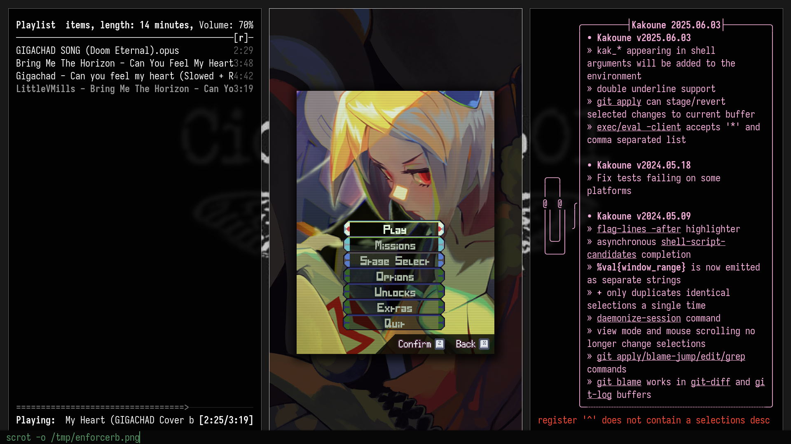

# Enforcer
Attempt at making a window manager,
inspired by
[SXWM](https://github.com/uint23/sxwm),
[Vox-WM](https://github.com/DerjenigeUberMensch/vox-wm) and
[Ratpoison](https://github.com/RatPoison-dev/RatPoison).

> NCMPCPP, Blue Revolver and Kakoune running under Enforcer.

## State:
Usable, but still not recommended.
It's a low-quality DWM skeleton.

Floating windows are not supported for the most part.

## Usage
- `Mod-enter`: open a new terminal (st)
- `Mod-p`: open dmenu
- `Mod-c`: close focused window
- `Mod-Shift-c`: close enforcer
- `Mod-j / Mod-k`: change focus
- `Mod-qwertyuio`: change workspace
- `Mod-Shift-qwertyuio`: change window workspace

## Testing instructions
Run `make init` to open a Xephyr environment,
then `make run` to build and run the program.
Change the init script at `scripts/init.sh`
to change the background.

----------------

## Todo:
- [ ] Shift+workspaceKey to move node
- [ ] Fullscreen mode (monocle)
- [ ] Test key to get prettified workspace data
- [ ] Handle firefox errors (when sharing screen, etc)
- [ ] Properly handle floating and popups (they often appear cut)

###  Wishlist:
- [ ] Create/remove workspaces and windows with no limits
- [ ] Modify the amount of windows shown (like mod+i in dwm) and scroll windows horizontally (like ratpoison)
- [ ] Global floating centered terminal (required)
- [ ] Use hooks to set up custom program executions (like st and dmenu)
- [ ] Non-immediate keybind execution like Ratpoison
- [ ] Mod+Tab to open hacker screen (I still not know what to use it for)
- [ ] UI elements + FZF-like search integration (like dmenu but with the looks of fzf, transparent and overlayed)
